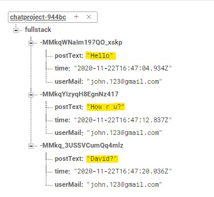

<h1 align="center">Chat Project--React Native</h1>


## Description

A work about making a Restaurant Application with CHAT AND DRAWER MENU PACKAGE.
With this project used GOOGLE FIRE BASE to control account issues.

And also used GOOGLE FIREBASE (RealTime Database)  for data storage and other operations.

With Realtimedatabase we setup an active listener to react to any changes to the node and its children.
To make chat bubbles we used Svg and Size-Matters packages


## This is a short video introduction about this app.





### At the end of the project, following topics are to be covered;

- HTML
- CSS
- JS
- [React](https://reactjs.org/)
- [React-Native](https://reactnative.dev/)
- [React-Navigation](https://reactnavigation.org/)
- Google Firebase (Authentication)


## How To Use

To clone and run this application, you'll need [Git](https://git-scm.com) and [Node.js](https://nodejs.org/en/download/) (which comes with [npm](http://npmjs.com)) installed on your computer. From your command line:

```bash

$ git clone https://github.com/KamilCetiner/Chat--App--with--React-Native

$ npm install

$ npx react-native run-android

```
## PACKAGES

```bash

$ npm install @react-navigation/native

$ npm add @react-native-firebase/app

$ npm add @react-native-firebase/database

npm add @react-native-firebase/auth

$ npm install react-native-reanimated react-native-gesture-handler react-native-screens react-native-safe-area-context @react-native-community/masked-view

$ npm add react-native-svg

$ npm install --save react-native-size-matters

$ npm install @react-navigation/stack

npm i react-native-modal

$ npm install --save react-native-vector-icons

npm install react-native-material-drawer --save

```

## Contact

- GitHub [@Kamil](https://github.com/KamilCetiner)
- Linkedin [@Kamil](https://www.linkedin.com/in/kamil-%C3%A7etiner-b09a601ab/)